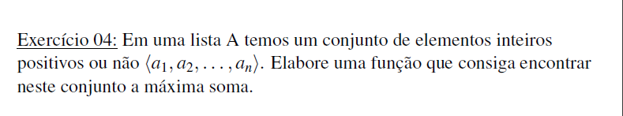
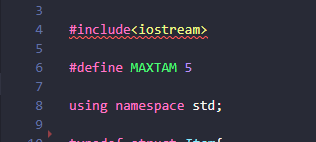

# Exercício 04: Máxima soma em uma lista

 
 
</a> 

<h6><a>Proposta do exercício</a></h6>

 

<h6><a>Como usar</a></h6>

O programa está configurado para ler 5 números que o usuário digitar para alterar isso mude o MAXTAM para o valor que deseje.

 

# Compilação e Execução

O exercício 04 disponibilizado possui um arquivo Makefile que realiza todo o procedimento de compilação e execução. Para tanto, temos as seguintes diretrizes de execução:

| Comando                |  Função                                                                                           |                     
| -----------------------| ------------------------------------------------------------------------------------------------- |
|  `make clean`          | Apaga a última compilação realizada contida na pasta build                                        |
|  `make`                | Executa a compilação do programa utilizando o g++, e o resultado vai para a pasta build           |
|  `make run`            | Executa o programa da pasta build após a realização da compilação                                 |

# Contato

<a href="https://t.me/caio_fer_dias">
 

